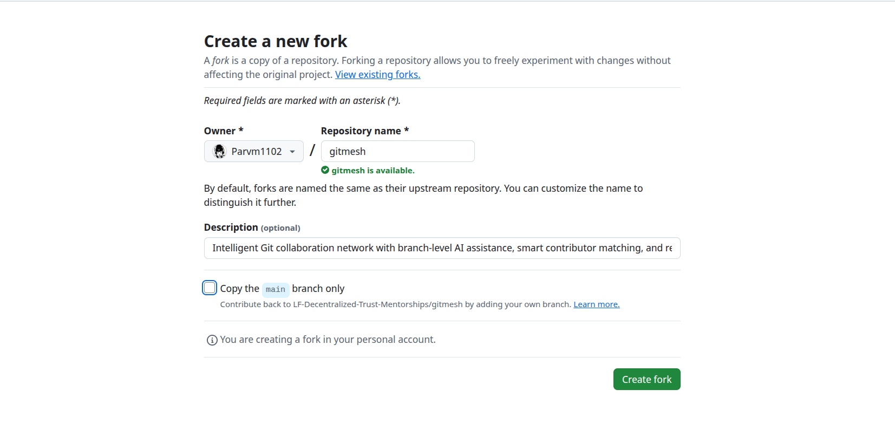
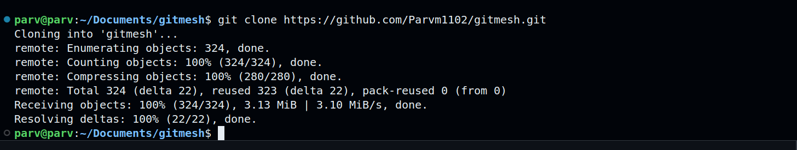
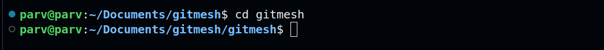
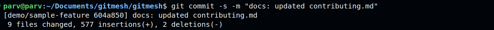
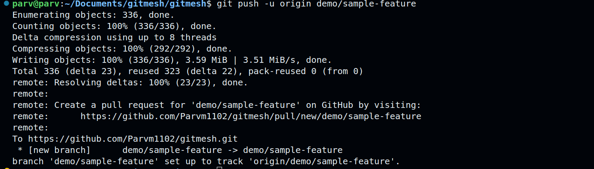
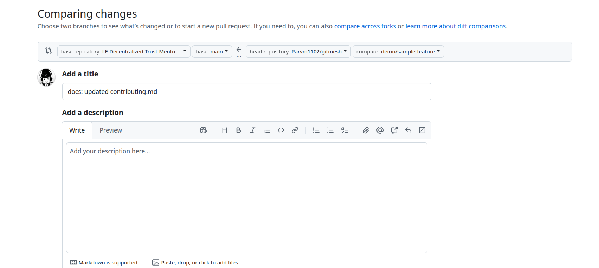

# Contributing to GitMesh

## Introduction

GitMesh is an open-source project under the Linux Foundation Decentralized Trust umbrella. It revolutionizes Git-based collaboration through Branch-Level Intelligence, providing contextual AI assistance and intelligent workflow orchestration. This comprehensive guide outlines how the GitMesh community can contribute to the project's development and growth.

GitMesh aims to transform how developers collaborate by integrating AI-powered insights directly into Git workflows, making version control more intelligent and developer-friendly. Whether you're fixing bugs, adding features, improving documentation, or enhancing the user experience, your contributions are valuable to our community.

## Prerequisites

### Essential Requirements


**Join the weekly meetings on Wednesday at 1 pm UTC time zone.**

These meetings are essential for:
- Understanding project roadmap and priorities
- Discussing implementation approaches
- Getting guidance on complex contributions
- Coordinating with other contributors
- Staying updated on project developments

## Code of Conduct and Legal Requirements

As a Linux Foundation Decentralized Trust project, GitMesh adheres to strict community standards:

- [Linux Foundation Privacy Policy](https://www.linuxfoundation.org/legal/privacy-policy)
- [Terms of Use](https://www.linuxfoundation.org/legal/terms)
- [Antitrust Policy](https://www.linuxfoundation.org/legal/antitrust-policy)
- [Code of Conduct](https://www.lfdecentralizedtrust.org/code-of-conduct)

Please review and understand these policies before contributing.


### Issue Selection

**Important**: Please select a task from the [published issues](https://github.com/LF-Decentralized-Trust-Mentorships/gitmesh/issues). Contributions not addressing existing issues will not be considered. For improvement proposals, kindly attend the Wednesday meetings.

### Workflow Overview

Below is the GitMesh project workflow:

**Workflow Schema:**
```
1. Fork Repository → 2. Clone Locally → 3. Create Branch → 
4. Make Changes → 5. Commit & Push → 6. Create Pull Request → 
7. Code Review → 8. Merge to dev → 9. Clean up
```

### Step-by-Step Contribution Guide

#### Step 1: Visit the GitMesh Repository

1. Open your web browser and navigate to the official GitMesh repository:
   ```
   https://github.com/LF-Decentralized-Trust-Mentorships/gitmesh
   ```

#### Step 2: Fork the Repository

1. **Locate the Fork Button**: In the top-right corner of the repository page, find and click the "Fork" button.


2. **Configure Fork Settings**: 
   - **Uncheck** the "Copy the main branch only" checkbox to ensure you get all branches
   - Leave the repository name as "gitmesh" (or customize if needed)
   - Ensure the description matches the original repository
   - Click "Create fork"

3. **Verify Fork Creation**: You'll be redirected to your personal fork at:
   ```
   https://github.com/YOUR_USERNAME/gitmesh
   ```




#### Step 3: Clone the Repository Locally

1. **Prepare Your Development Environment**:
   - Create a new folder on your local machine for GitMesh development
   - Open the folder in VS Code or your preferred IDE
   - Open a new terminal within your IDE


2. **Copy the Repository URL**:
   - On your fork's GitHub page, click the green "Code" button
   - Ensure "HTTPS" is selected
   - Click the copy icon to copy the URL to your clipboard


3. **Clone the Repository**:
   ```bash
   git clone https://github.com/YOUR_USERNAME/gitmesh.git
   ```
   
   Replace `YOUR_USERNAME` with your actual GitHub username.



4. **Verify Cloning Success**:
   - You should see output indicating the repository was cloned successfully
   - A new `gitmesh` folder should appear in your directory

#### Step 4: Navigate to GitMesh Directory

1. **Change Directory**:
   ```bash
   cd gitmesh
   ```



2. **Verify Repository Structure**:
   ```bash
   ls -la
   ```
   
   You should see the project structure.

#### Step 5: Set Up Remote Upstream

1. **Add Upstream Remote**:
   ```bash
   git remote add upstream https://github.com/lfdt-gitmesh/gitmesh.git
   ```

2. **Verify Remotes**:
   ```bash
   git remote -v
   ```
   
   You should see both `origin` (your fork) and `upstream` (official repository).


#### Step 6: Check Available Branches

1. **List All Branches**:
   ```bash
   git branch -a
   ```


2. **Understanding Branch Structure**:
   - `main`: Production-ready code
   - `remotes/origin/*`: Branches from your fork
   - `remotes/upstream/*`: Branches from the official repository

#### Step 7: Checkout Development Branch

1. **Switch to a new Branch**:
   
   If the branch doesn't exist locally:
   ```bash
   git checkout -b dev origin/dev
   ```

2. **Verify Current Branch**:
   ```bash
   git branch
   ```
   
   The current branch should be highlighted with an asterisk (*).

#### Step 8: Create Your Feature Branch

1. **Create and Switch to Feature Branch**:
   ```bash
   git checkout -b feature/your-descriptive-feature-name
   ```
   
   **Branch Naming Conventions**:
   - `feature/description` - New features
   - `bugfix/description` - Bug fixes
   - `hotfix/description` - Critical fixes
   - `docs/description` - Documentation updates
   - `refactor/description` - Code refactoring
   
   **Example**:
   ```bash
   git checkout -b feature/ai-context-suggestions
   ```


2. **Confirm New Branch Creation**:
   ```bash
   git status
   ```


#### Step 9: Make Your Changes

For development setup instructions, please refer to [Readme.md](README.md).

2. **Implement Your Changes**:
   - Write your code following the project's coding standards
   - Add appropriate tests for new functionality
   - Update documentation as needed
   - Ensure your changes align with the selected issue requirements

#### Step 10: Track Your Changes

1. **Check File Status**:
   ```bash
   git status
   ```
   
   This shows:
   - Modified files (red)
   - New files (red)
   - Files ready to commit (green)


2. **Review Changes**:
   ```bash
   git diff
   ```
   
   This displays the exact changes made to files.

#### Step 11: Stage Your Changes

1. **Add Specific Files**:
   ```bash
   git add path/to/specific/file.js
   ```
   
   Or add all changes:
   ```bash
   git add .
   ```


2. **Verify Staged Changes**:
   ```bash
   git status
   ```
   
   Files ready to commit should now appear in green.

#### Step 12: Commit Your Changes

1. **Create Signed Commit** (Required for Linux Foundation):
   ```bash
   git commit -s -m "type(scope): Brief description of changes
   
   - Detailed explanation of what was changed
   - Why the change was necessary  
   - Reference to issue number (#123)
   - Any breaking changes or special notes"
   ```

   **Important**: The `-s` flag is mandatory for Linux Foundation projects as it adds a "Signed-off-by" line.




#### Step 13: Push to Your Fork

1. **Push Feature Branch**:
   ```bash
   git push -u origin feature/your-feature-name
   ```
   
   The `-u` flag sets up tracking between your local and remote branch.




2. **Verify Push Success**:
   - Check your GitHub fork in the browser
   - Your new branch should appear in the branch dropdown
   - Recent commits should be visible


#### Step 14: Create Pull Request

1. **Navigate to Your Fork**:
   - Go to your fork on GitHub: `https://github.com/YOUR_USERNAME/gitmesh`
   - GitHub should display a banner suggesting to create a pull request


2. **Initiate Pull Request**:
   - Click "Compare & pull request" button
   
   Or manually:
   - Click "Pull requests" tab
   - Click "New pull request"
   - Select your feature branch as the source
   - Select `lfdt-gitmesh/gitmesh:dev` as the destination




3. **Configure Pull Request Details**:
   
   **Title Format**:
   ```
   type(scope): Brief description
   ```
   
   **Required Information in Description**:
   ```markdown
   ## Description
   Brief summary of changes made and motivation behind them.
   
   ## Changes Made
   - Specific change 1
   - Specific change 2
   - Specific change 3
   
   ## Testing Completed
   - [ ] Unit tests pass locally
   - [ ] Integration tests pass
   - [ ] Manual testing completed
   - [ ] No performance regressions detected
   
   ## Related Issues
   Fixes #123
   Addresses #456
   
   ## Breaking Changes
   - List any breaking changes (if none, state "None")
   
   ## Documentation Updates
   - [ ] Code comments updated
   - [ ] API documentation updated
   - [ ] User documentation updated (if applicable)
   
   ## Screenshots/Videos
   (Include if UI changes were made)
   ```


4. **Submit Pull Request**:
   - Review all information for accuracy
   - Click "Create pull request"
