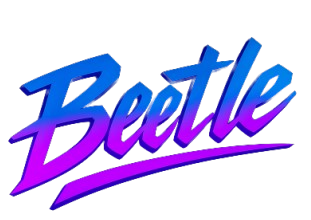

<div align="center">



**The Next-Generation Git Collaboration Platform**

*Transforming Open Source Development with AI-Powered Branch Intelligence*

[](LICENSE.md)
[](https://github.com/RAWx18/Beetle/graphs/contributors)
[](#)
[](https://discord.gg/FkrWfGtZn3)
[](https://www.bestpractices.dev/projects/10871)
[](https://scorecard.dev/viewer/?uri=github.com/RAWx18/Beetle)
[](https://app.fossa.com/projects/git%2Bgithub.com%2Ffossas%2Ffossa-cli?ref=badge_shield)

[🚀 **Try Demo**](https://beetle-demo.vercel.app/) • [📖 **Documentation**](https://github.com/RAWx18/Beetle/README.md) • [💬 **Join Community**](https://discord.gg/FkrWfGtZn3)

</div>

---

<div align="center">
  <h3>Security & Open Source Badge</h3>

  <a href="https://www.bestpractices.dev/projects/10871" style="margin-right: 30px;">
    
  </a>

  <a href="https://github.com/marketplace/actions/ossf-scorecard-action" style="margin-left: 30px;">
    
  </a>
</div>

---

## 🌟 What is Beetle?


**Beetle** revolutionizes Git-based collaboration by introducing **Branch-Level Intelligence** — a paradigm shift that transforms how teams plan, develop, and contribute to open-source projects. Unlike traditional project management tools, Beetle understands your codebase at the branch level, providing contextual AI assistance, intelligent contribution tracking, and seamless workflow orchestration.

Our friendly mascot here represents the core philosophy of Beetle: small, efficient, but incredibly powerful when working together in a team!

Cursor wrapped VS Code. Hugging Face wrapped Git. Now, GitHub Wrapper is here — ready to revolutionize the open source world like never before.

---

# ⚡ Key Features

<div align="center">

### 🧠 **AI-Powered Intelligence**
```
┌─────────────────────────────────────────────────────────────┐
│  ✨ Contextual Code Assistant                               │
│  📝 Smart PR Summaries                                      │
│  🎯 Intelligent Issue Triage                                │
│  👀 Code Review Assistance                                  │
│  💡 Suggestions on which issues to work                     │
│  🎪 Which project best to contribute to and all             │
└─────────────────────────────────────────────────────────────┘
```

### 🔄 **Easy Workflow Management**
```
┌─────────────────────────────────────────────────────────────┐
│  🌿 Branch-Specific Planning                                │
│  🤝 Help opensource contributors know what's important      │
│  🔄 Automated Status Tracking                               │
│  📋 Custom Workflow Templates                               │
└─────────────────────────────────────────────────────────────┘
```

### 📊 **Analytics & Insights**
```
┌─────────────────────────────────────────────────────────────┐
│  🔥 Contribution Heatmaps                                   │
│  ⚡ Velocity Tracking                                        │
│  👥 See who's working on which issue/PR                     │
│  📈 Team Performance Dashboards                             │
│  🎯 Showcase skills & avoid conflicts                       │
└─────────────────────────────────────────────────────────────┘
```

### 🌐 **Enterprise Integration**
```
┌─────────────────────────────────────────────────────────────┐
│  🔗 Multi-Platform Support (GitHub, GitLab, Bitbucket)      │
│  🔐 SSO Authentication                                      │
│  🤖 Multi Agent FAQ agent integrated                        │
│  ⚡ Webhook Automation                                       │
└─────────────────────────────────────────────────────────────┘
```

</div>

---

<div align="center">

## 🚀 **Why Choose Our Platform?**

| 🎯 **Smart** | 🚀 **Fast** | 🤝 **Collaborative** | 🔒 **Secure** |
|:---:|:---:|:---:|:---:|
| AI-driven insights | Lightning fast responses | Team-first approach | Enterprise-grade security |
| Contextual recommendations | Real-time updates | Conflict-free workflows | SSO & compliance ready |

</div>

---

## 🚀 Quick Start

<div align="center">

</div>

### Prerequisites

- Node.js v18+ and npm/yarn
- Python 3.11+
- Qdrant database (cloud or local)
- Git

### Environment Variables

> Backend Configuration

```bash
cp beetle_backend/env.example beetle_backend/.env
```

> Frontend Configuration

```bash
cp beetle_frontend/env.example beetle_frontend/.env
```

> **Note**: Replace all placeholder values (starting with `your_`) with your actual configuration values.

### Installation

1. **Clone the repository**
   ```bash
   git clone https://github.com/RAWx18/Beetle.git
   cd Beetle
   ```

2. **Setup Python Backend**
   ```bash
   cd beetle_backend
   python -m venv venv
   source venv/bin/activate  # On Linux/Mac
   .\venv\Scripts\activate # On Windows
   pip install -r requirements.txt
   ```

3. **Setup JavaScript Backend**
   ```bash
   cd beetle_backend
   npm install
   ```

4. **Setup Frontend**
   ```bash
   cd beetle_frontend
   npm install
   ```

### Running the Application

1. **Start Python Backend** (in first terminal)
   ```bash
   cd beetle_backend
   source venv/bin/activate  # On Linux/Mac
   .\venv\Scripts\activate # On Windows
   cd src/ai
   uvicorn fastapi_server:app --host 0.0.0.0 --port 8000 --reload
   ```

2. **Start JavaScript Backend** (in second terminal)
   ```bash
   cd beetle_backend
   ./setup.bat # On windows
   ./setup.sh # On linux
   ./setup.js # On Mac
   ```

3. **Start Frontend** (in third terminal)
   ```bash
   cd beetle_frontend
   npm run dev
   ```

4. **Access the Application**
   - Frontend: http://localhost:3000
  
### Static Demo

[Deployed on Vercel](https://beetle-demo.vercel.app/)

## 🛣️ Roadmap


### 🚀 **Q3 2025 - Intelligence Enhancement**
- ✅ ~~Structure Idea~~
- ✅ ~~UI Designed~~
- ✅ ~~Static Demo Implemented~~
- ✅ ~~Backend with Github Integrated~~
- ⏳ AI RAG integration
- ⏳ Security Enhancement & Rate Limit Optimization

[📋 **View Full Roadmap**](https://beetle-github.vercel.app/)

---

## 🤝 Contributing


We welcome contributions! Please see our [Contributing Guide](CONTRIBUTING.md) for details.

### Quick Contributing Steps:
1. Fork the repository
2. Create a feature branch
3. Make your changes
4. Submit a pull request

Our mascot is excited to see what amazing contributions you'll bring to the Beetle community!

<p align="center">

</p>

---

## 🌍 Community & Support

<div align="center">

[](https://discord.gg/FkrWfGtZn3)

### 📞 **Support Channels**

| Channel                                                         | Typical Response Time | Best For                                             |
| --------------------------------------------------------------- | --------------------- | ---------------------------------------------------- |
| 🎮 [Discord](https://discord.gg/FkrWfGtZn3)                     | Real-time             | Quick questions, community discussions               |
| 📧 [Email Support](mailto:rawx18.dev@gmail.com)                 | 24–48 hours           | Technical issues, detailed bug reports               |
| 🐦 [Twitter / X](https://x.com/RAWx18_dev)                      | Online                | Tagging the project, general updates, public reports |
| 🐛 [GitHub Issues](https://github.com/beetle-dev/beetle/issues) | 1–3 days              | Bug reports, feature requests, feedback              |

</div>

---

## 📊 Project Statistics

<div align="center">

| Metric | Value |
|--------|-------|
| 📝 **Total Commits** |  |
| 🔀 **Pull Requests** |  |
| 🐛 **Issues Resolved** |  |
| 📦 **Latest Release** |  |

</div>

---

## 📜 License

This project is licensed under the Non-Commercial Use License - see the [LICENSE.md](LICENSE.md) file for details.

---

## 🙏 Acknowledgments

- All our contributors and community members
- Open source libraries that made this possible
- Beta testers and early adopters

---

## 🌟 Star Graph: Project Beetle

<div align="center">  <br/> <sub>✨ GitHub star history of <strong><a href="https://github.com/RAWx18/beetle" target="_blank">RAWx18/beetle</a></strong></sub> </div>

---

<br></br>

<div align="center">

**Made with ❤️ by the Beetle Team**

*Transforming the future of collaborative development, one commit at a time.*

</div>